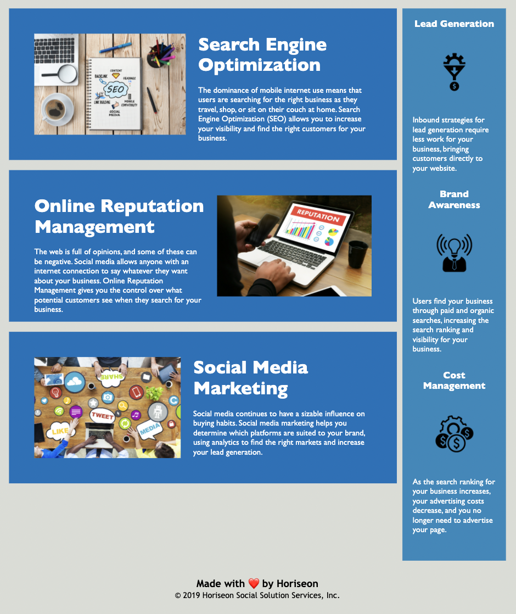

# Horiseon Responsive Refactor

## Mitchel Wachtel - mitchel.wachtel@gmail.com

### UPGRADED - GT Coding Bootcamp - Homework due 1/3/22 - "Code Refractor"

---
## Description

**Below is still true, but in addition, the main purpose of this was for me to practice flexbox, and responsive design. That is why I'm including this in my portfolio.**

Technologies used: HTML, CSS, and GitHub pages in order to publish the site.

My main motivation for this project was to better understand the semantic structure of HTML and practice using CSS selectors efficiently.

In refractoring this code, I've solved several issues. First, with semantic tags in the HTML, it is easier to work on and for browsers to predict the content of a webpage. I refractored this code so that the HTML is more web accessible for assistive tech and the webpage is more condusive to search engines.

I learned a lot throughout this project. First, I spent a lot of time getting a better understanding of the `<section>` tags vs `<article>`, `<figure>`, and `
` tags. It was difficult for me to decide when each would be better used. freeCodeCamp.org really helped me on this topic: "`
` - groups content `<section>` - groups related content `<article>` - groups independent, self-contained content".  I have realized the importance of accomplishing one task at a time. I was in the middle of making the `
` tags semantic when I realized there was a broken link, and I had to get back on track after dealing with that tangent. I gained good practice in commiting often to git and writing much more concise css. I see the importance in class vs. id. Overall, I am much more confident in writing and reading html and css. In addition, I'm learning the value of a README file and with feedback I'm hoping to soon be able to create professional README files.

My greatest challenge of this project was deciding on the `<section>` tags instead of using any `<article>` or `<figure>` tags. Ultimately, I did not see any of the containers of this page as `<figure>`s because never was an image vital for the user's comprehension of the webpage. Additionally, I did not see any of the containers as `<article>`s because never was there one that contained more than two sentences, so I couldn't reason through any of these being considered an `<article>`.

My next steps would be to add responsive design elements to this webpage because as the width of the page decreases for a tablet and smartphone, the containers react in a way that would be very difficult for the user to have a satisfying experience.

---

### **Deployed Site** can be found *[here](https://mitchelwachtel.github.io/GTbootcamp-CodeRefractor/)*. 

---

### **GitHub Repository** can be found *[here](https://github.com/mitchelwachtel/GTbootcamp-CodeRefractor)*.

---
## Installation 

Simply open in a brower and the webpage should appear as below.

---
## Credits

This was a project in which I was given starter code to improve upon. It was given to me through the GT Coding Bootcamp. In order to adapt the HTML with Semantics, I used *[this resource](https://www.w3schools.com/html/html5_semantic_elements.asp)* from W3 Schools and the *[Applied Accessibility](https://www.freecodecamp.org/learn/responsive-web-design/applied-accessibility/)* section of freeCodeCamp.org. In order to write a professional README file, I relied heavily upon *[this resource](https://coding-boot-camp.github.io/full-stack/github/professional-readme-guide)* from Request-Response: The Full-Stack Blog.

---
## License

GNU General Public License v3.0
